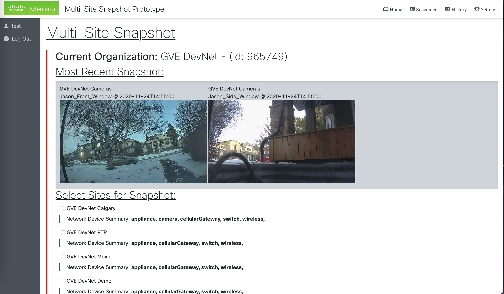

Meraki Multi-Site Snapshot
-------------------------------------

A Prototype built to leverage Meraki network technology and Meraki Snapshot API to take Multi-Site snapshots at any given point in time.


## Contacts
* Alexander Hoecht

## Solution Components
* Python 3 [Download latest version](https://www.python.org/downloads/)
* Flask
* HTML / CSS / JQuery

## Installation/Configuration
Steps needed to install and configure the project's environment
```
# Create a Virtual Environment
python3 -m venv Virtual_Environment

# Activate Virtual Environment
source Virtual_Environment/bin/activate # (MacOS)
Virtual_Environment/Scripts/activate # (Windows)

# Install Dependencies
pip install -r requirements.txt
```

## Starting the Application
Once Dependencies are installed to Environment:
```
# Setup Flask application
export FLASK_APP=src # (MacOS)
set FLASK_APP=src # (Windows Command Prompt)
$env:FLASK_APP = "src" # (Windows PowerShell)

# Enable Development Features
export FLASK_ENV=development

# Start Application
flask run
```

# User Interface


# High-Level Diagram


### LICENSE

Provided under Cisco Sample Code License, for details see [LICENSE](LICENSE.md)

### CODE_OF_CONDUCT

Our code of conduct is available [here](CODE_OF_CONDUCT.md)

### CONTRIBUTING

See our contributing guidelines [here](CONTRIBUTING.md)

#### DISCLAIMER:
<b>Please note:</b> This script is meant for demo purposes only. All tools/ scripts in this repo are released for use "AS IS" without any warranties of any kind, including, but not limited to their installation, use, or performance. Any use of these scripts and tools is at your own risk. There is no guarantee that they have been through thorough testing in a comparable environment and we are not responsible for any damage or data loss incurred with their use.
You are responsible for reviewing and testing any scripts you run thoroughly before use in any non-testing environment.